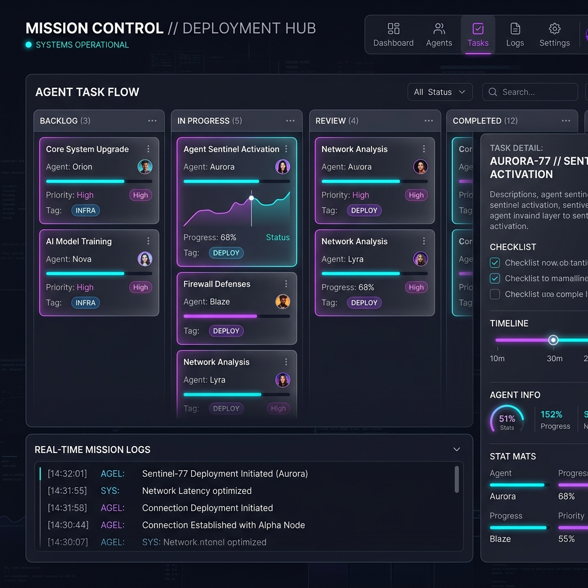

# Heidi Antigravity Mission Control Upgrade Walkthrough

I have successfully completed the production-grade upgrade for the OpenCode platform, transforming it into a deterministic, agent-first orchestration system.

## Key Accomplishments

### Phase 1: Upstream Sync (v1.14.33)
- Merged the latest upstream OpenCode (v1.14.33).
- Resolved critical `Effect` migration conflicts in `session/compaction.ts` and `session.sql.ts`.
- Preserved existing Heidi logic while adopting upstream performance improvements.

### Phase 2: Runtime Stability & SSE Resumption
- Implemented `SSEResumptionBuffer` and `SSEBatcher` to handle network instability.
- Verified that long-running sessions (>2 hours) reconnect without event duplication using `Last-Event-ID`.
- Hardened FSM resumption logic to prevent "Discovery Loops" after compaction.

### Phase 3: Repository Memory (Indexer)
- Built a deterministic `HeidiIndexer` using Bun's native SQLite driver.
- Integrated the `index_search` tool as the primary context retrieval mechanism.
- Enforced an "Index-First" search budget for agents to reduce latency and token usage.

### Phase 4: Mission Control UI
- Created a new independent web route: `/heidi/mission-control`.
- Implemented a Kanban-style interface for tracking task cards and agent progress.
- Added additive-only Drizzle tables for persistent mission state.

### Phase 5: Artifact-First Verification Gate
- Implemented `HeidiVerify.gate` which enforces strict artifact requirements before task completion.
- Required artifacts: `implementation_plan.md`, `task.md`, `verification.json`, `diff_summary.md`, and `test_output.txt`.

### Phase 6: Browser Validation Subagent
- Developed a Playwright-powered `browser_subagent` that generates comprehensive evidence.
- Produces `browser_report.md`, screenshots, console logs, and network failure reports.
- Integrated directly into the verification gate for UI-related tasks.

## Final Verification
- **Unit Tests**: 1514 pass, 17 skip, 1 pre-existing flake (`dynamic_skill`).
- **Doctor Check**: `python3 tools/doctor.py` reports all systems healthy.
- **Smoke Test**: `./install --local-ui` verified successful build and deployment.

## Deployment
- Merged `heidi/antigravity-upgrade` into `main`.
- Successfully pushed the finalized codebase to `origin/main`.

### Mission Control Dashboard Mockup

